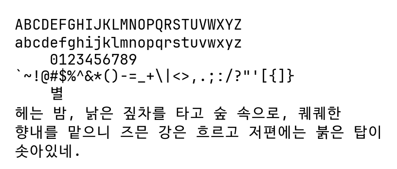

# Windows에서 Mac과 비슷한 부드러운 폰트 적용하기

이 가이드는 Windows 11/10에서 Mac OS와 유사한 부드러운 폰트 렌더링을 구현하는 방법을 설명합니다. 주로 레지스트리 편집과 MacType이라는 서드파티 프로그램을 활용합니다.


# 기본 설정 방법

1. 시작 메뉴에서 "실행"을 검색하여 실행하거나 Windows 키 + `R`을 눌러 실행 창을 엽니다.
2. 실행 창에 "regedit"를 입력하고 확인을 클릭하여 레지스트리 편집기를 실행합니다.
3. 다음 경로로 이동합니다: 
   `HKEY_LOCAL_MACHINE\SOFTWARE\Microsoft\Windows NT\CurrentVersion\FontSubstitutes`
4. 해당 위치에서 우클릭하여 새로 만들기 > 문자열 값을 선택합니다.
5. 다음 항목들을 새 문자열 값으로 추가하고, 각각의 값을 원하는 폰트 이름으로 설정합니다:
   - Arial
   - Gulim
   - GulimChe
   - Segoe UI
   - Malgun Gothic
6. 모든 값이 정확히 입력되었는지 확인한 후 컴퓨터를 재부팅합니다.
7. 재부팅 후 시스템 전반에 걸쳐 지정한 폰트가 적용된 것을 확인할 수 있습니다.

# ClearType 설정 최적화

Windows에 내장된 ClearType 텍스트 튜너를 사용하면 화면의 텍스트를 더 선명하고 읽기 쉽게 만들 수 있습니다.

1. 시작 메뉴에서 "ClearType"을 검색하고 "ClearType 텍스트 조정"을 선택합니다.
2. "ClearType 사용" 확인란이 선택되어 있는지 확인하고 "다음"을 클릭합니다.
3. 화면의 지시에 따라 여러 텍스트 샘플 중 가장 보기 편한 것을 선택합니다.
4. 모든 단계를 완료하면 "마침"을 클릭하여 설정을 저장합니다.

# 고 DPI 디스플레이 설정

고해상도 디스플레이(QHD, UHD 등)에서는 DPI 스케일링 설정을 조정하여 텍스트를 더 선명하게 볼 수 있습니다.

1. 바탕화면에서 우클릭하여 "디스플레이 설정"으로 이동합니다.
2. "배율 및 레이아웃" 섹션에서 "텍스트, 앱 및 기타 항목의 크기 변경" 옵션을 찾습니다.
3. 권장 배율을 사용하거나, "고급 배율 설정"으로 이동하여 사용자 지정 배율을 설정할 수 있습니다.
4. 사용자 지정 배율을 사용하는 경우, 100%에서 500% 사이의 값을 입력하고 "적용"을 클릭합니다. 이 설정을 적용하려면 로그아웃해야 할 수 있습니다.

# 글꼴 캐시 재설정

가끔 글꼴이 깨지거나 제대로 표시되지 않는 경우, 글꼴 캐시를 재설정하여 문제를 해결할 수 있습니다.

1. 시작 메뉴에서 "서비스"를 검색하여 실행합니다.
2. `Windows Font Cache Service`를 찾아 중지합니다.
3. 파일 탐색기를 열고 주소 표시줄에 `%windir%\\ServiceProfiles\\LocalService\\AppData\\Local\\FontCache`를 입력하여 해당 폴더로 이동합니다.
4. 폴더 안의 모든 `.dat` 파일을 삭제합니다.
5. 컴퓨터를 재부팅합니다. 재부팅 후 글꼴 캐시가 자동으로 다시 생성됩니다.

# 대체 글꼴 렌더러

MacType 외에도 GDIpp와 같은 다른 글꼴 렌더러를 사용하여 Windows의 텍스트 렌더링을 개선할 수 있습니다. GDIpp는 Windows의 기본 GDI 렌더링을 대체하여 더 부드러운 텍스트를 제공합니다.

**GDIpp 사용법:**

1. GDIpp 프로젝트 페이지에서 최신 버전을 다운로드하여 설치합니다.
2. 설치 후 시스템 트레이에서 GDIpp 아이콘을 통해 설정을 관리할 수 있습니다.
3. 특정 프로그램에서 GDIpp를 사용하지 않으려면 예외 목록에 추가할 수 있습니다.

**참고:** GDIpp는 MacType과 유사하게 작동하지만, 일부 시스템에서는 더 나은 호환성을 보일 수 있습니다.

# 서드파티 프로그램

MacType과 noMeiryoUI는 Windows에서 폰트 렌더링을 개선하고 시스템 폰트를 변경하는 데 사용되는 유틸리티 프로그램입니다.

## MacType 사용법:

1. MacType 공식 웹사이트에서 최신 버전을 다운로드하고 설치합니다.
2. 설치 후 MacType 설정 창이 열립니다.
3. "프로필 선택" 탭에서 원하는 렌더링 프로필을 선택합니다 (예: LCD, 기본 등).
4. "실행 모드" 탭에서 원하는 실행 모드를 선택합니다 (서비스 모드 권장).
5. "적용" 버튼을 클릭하고 컴퓨터를 재시작합니다.
6. 시스템 트레이의 MacType 아이콘을 통해 설정을 조정하거나 비활성화할 수 있습니다.

## noMeiryoUI 사용법:

1. noMeiryoUI 프로젝트 페이지에서 최신 버전을 다운로드합니다.
2. 압축을 풀고 noMeiryoUI.exe를 실행합니다 (관리자 권한 필요).
3. 프로그램 창에서 각 UI 요소 (제목 표시줄, 아이콘 제목 등)에 대해 원하는 폰트와 크기를 선택합니다.
4. "모든 설정 변경" 버튼을 클릭하여 변경사항을 적용합니다.
5. 변경 사항을 확인하려면 로그오프 후 다시 로그인하거나 컴퓨터를 재시작합니다.

## 주의사항:
- 두 프로그램 모두 시스템 설정을 변경하므로 사용 전 시스템 복원 지점을 생성하는 것이 좋습니다.
- MacType은 일부 프로그램과 충돌할 수 있으므로, 문제 발생 시 해당 프로그램을 예외 목록에 추가하거나 MacType을 일시적으로 비활성화할 수 있습니다.
- noMeiryoUI는 Windows의 기본 폰트 설정을 변경하므로, 시스템 안정성에 영향을 줄 수 있습니다. 변경 후 문제가 발생하면 기본 설정으로 복원할 수 있습니다.

# 추천 폰트

1. 고딕체 폰트 = [Pretendard](https://github.com/orioncactus/pretendard)
2. 명조체 폰트 = [Maruburi](https://hangeul.naver.com/)
3. 고정폭 폰트 = [Menlo](https://github.com/ryanoasis/nerd-fonts/tree/master/patched-fonts/Meslo)


# 알려진 문제와 해결 방법

## 시작 메뉴 폰트 문제
가끔 시작 메뉴의 폰트가 변경되지 않고 기본 Windows 폰트로 표시되는 경우가 있습니다. 이는 MacType보다 `explorer.exe`가 먼저 실행되어 발생하는 문제로 추정됩니다.

해결 방법:
1. 작업 관리자를 실행합니다 (Ctrl + Shift + Esc).
2. 프로세스 탭에서 "Windows 탐색기" (`explorer.exe`)를 찾아 작업 끝내기를 클릭합니다.
3. 작업 관리자의 "파일" 메뉴에서 "새 작업 실행"을 선택합니다.
4. `explorer.exe`를 입력하고 확인을 클릭합니다.

이 방법으로 변경된 폰트가 적용된 탐색기가 다시 실행됩니다.

## 웹 브라우저 관련 문제

크로미움 기반 브라우저(Chrome, Edge 등)에서는 보안상의 이유로 서드파티 DLL을 차단할 수 있습니다. 이로 인해 MacType이 정상 작동하지 않을 수 있습니다.

해결 방법:
1. 브라우저 바로가기 속성의 대상 끝에 `--disable-features=RendererCodeIntegrity` 추가
2. 레지스트리 수정을 통해 브라우저의 `RendererCodeIntegrity` 기능 비활성화

## Firefox 관련 설정

Firefox는 일반적으로 `DirectWrite` 모드로 인해 문제가 없지만, 렌더링 불일치가 발생할 수 있습니다.

해결 방법:
1. 주소창에 `about:config` 입력
2. `cleartype` 검색
3. `gfx.font_rendering.cleartype_params.rendering_mode` 값을 5로 변경

## Java 기반 애플리케이션

Java 기반 앱에서 문제가 발생하면 해당 앱의 .ini 파일에 `clipboxfix=1`을 추가하여 해결할 수 있습니다.

예시 (IntelliJ IDEA):
```
[Experimental@idea64.exe]
clipboxfix=1
```

## 특정 프로그램에서 렌더링 제외

MacType이나 GDIpp가 특정 프로그램과 충돌하는 경우, 해당 프로그램의 실행 파일을 예외 목록에 추가하여 기본 렌더링을 사용하도록 설정할 수 있습니다. 각 렌더러의 설정 화면에서 예외 목록을 관리할 수 있습니다.

## 관리자 권한으로 실행

일부 시스템에서는 폰트 렌더링 프로그램이 제대로 작동하려면 관리자 권한으로 실행해야 할 수 있습니다. 프로그램 바로가기 속성에서 "관리자 권한으로 이 프로그램 실행"을 선택하여 항상 관리자 권한으로 실행되도록 설정할 수 있습니다.

주의: 이 가이드에 따라 시스템을 수정할 때는 주의가 필요합니다. 레지스트리 편집이나 시스템 설정 변경은 시스템 안정성에 영향을 줄 수 있으므로, 반드시 백업을 먼저 진행하고 신중히 작업하세요.

### a꽃피는봄


### JBD2



